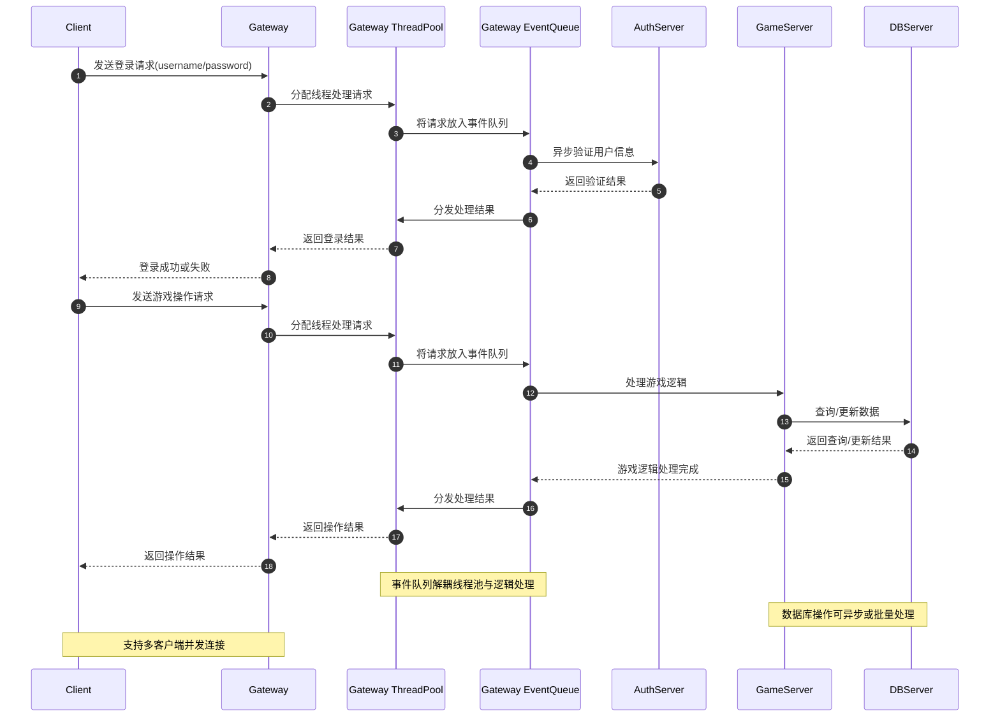
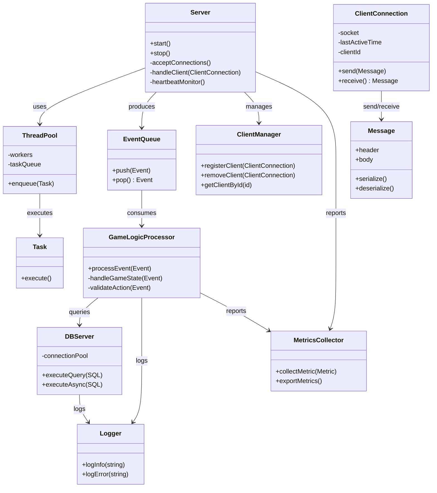
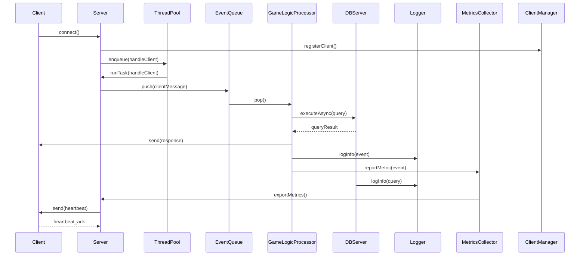

# 🍅 Tomato Server

[](https://isocpp.org/)  
[](https://www.boost.org/)  
[](https://www.mysql.com/)  
[](LICENSE)

---

## 📖 Overview

**Tomato Server** is a modern, modular TCP server framework written in **C++17**, designed for high-performance network
applications.  
It emphasizes clean architecture, asynchronous operations, and easy extensibility.

Key features:

- Multi-threaded, asynchronous network communication using **Boost.Asio**
- Thread-safe **MySQL connection pool** for database operations
- Modular protocol layer supporting **JSON**, **Protobuf**, and **FlatBuffers**
- Flexible message dispatcher and logic processor
- Centralized logging using **Boost.Log**
- Configuration via **YAML** files

---

## 📁 Project Structure

```txt
tomato_server/
├─ CMakeLists.txt
├─ README.md
├─ config.yaml
├─ include/
│   ├─ IMessage.h
│   ├─ JsonMessage.h
│   ├─ ProtoMessage.h
│   ├─ FlatMessage.h
│   ├─ ProtocolParser.h
│   ├─ MessageDispatcher.h
│   ├─ Session.h
│   ├─ Server.h
│   ├─ MySQLPool.h
│   ├─ LogicProcessor.h
│   ├─ Logger.h
│   └─ ConfigLoader.h
├─ src/
├─ cpp/
└─ third_party/
```

---

## 🔹 Architecture

```txt
+------------------+
|      Network     |
|  (Server/Session)|
+------------------+
         |
         v
+------------------+
|     Protocol     |
| (Parser/Message) |
+------------------+
         |
         v
+------------------+
|       Logic      |
| (Dispatcher/Logic)|
+------------------+
         |
         v
+------------------+
|     Database     |
|   (MySQL Pool)   |
+------------------+
```

- **Network Layer**: Manages TCP connections and reads/writes asynchronously
- **Protocol Layer**: Handles packet parsing, sticky packet splitting, and message serialization/deserialization
- **Logic Layer**: Dispatches messages to handlers, processes business logic
- **Database Layer**: Provides thread-safe MySQL connection pool and async queries

---

## ⚡ Technology Stack

| Component                  | Purpose                                        |
|----------------------------|------------------------------------------------|
| **C++17**                  | Modern language features, smart pointers, RAII |
| **Boost.Asio**             | High-performance asynchronous network I/O      |
| **Boost.Log**              | Thread-safe logging                            |
| **MySQL**                  | Persistent data storage with connection pool   |
| **YAML-CPP**               | Configuration management                       |
| **Protobuf / FlatBuffers** | Efficient message serialization                |
| **CMake**                  | Build system, dependency management            |

---

## 🚀 Quick Start

1. **Install dependencies** (Boost, MySQL, YAML-CPP, etc.)
2. **Build the server**:

```bash
mkdir build && cd build
cmake ..
cmake --build .
```

3. Run the server:

`./tomato_server`

4. Configure the server via config.yaml

⸻

🔧 Notes
• Fully thread-safe design using std::mutex and modern C++ concurrency features
• Asynchronous database operations via std::future / std::promise
• Protocol layer supports JSON, Protobuf, FlatBuffers interchangeably
• Easily extendable: add new message types or business logic without touching network or database code







⸻

📜 License

MIT License © 2025

